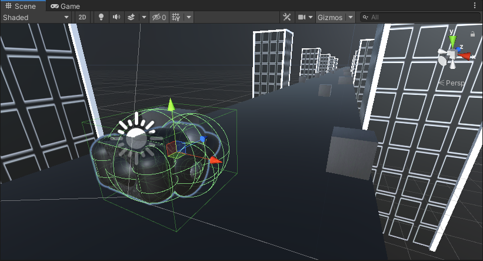
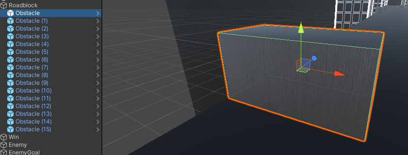
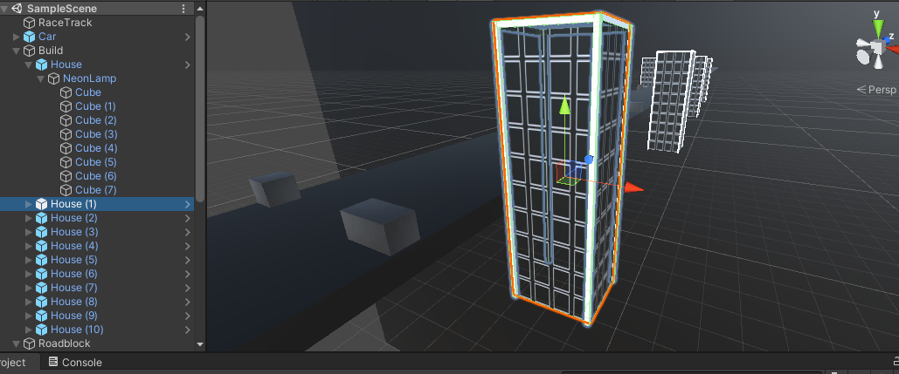
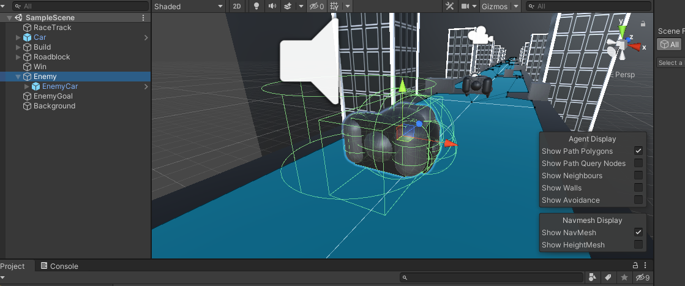

# GameEngines1-CA

Game Engines 1 Assingment
Cyberpunk formula racing

# Description of the project

Under the colorful neon lights, the players control the cool racing cars to follow the music in the city, the neon lights will change with the rhythm of music.

# Student informations

Name: Mingjun Gao

Student Number: D16122910

Class Group: DT228/Year4

# Instructions for use

Use the A/D buttons to control the left and right movement, W/S buttons to control acceleration and braking of the racing car. Use R buttons to Restart the game.

In this game, you can manipulate the car to release on the track, and there will be a competitors on the track. Your goal is to surpass your competitors and get the first place. Enjoy the game while enjoying the gorgeous builds.

# Parts that come from the course:
-Add audio and color-changing background building

-Enemy AI automatically finds its way.

-Create racing model.

# Most proud of：
-Gorgeous neon city

-Free operation of the car.

# List of classes:
| Class/asset | Source |
|-----------|-----------|
| Car.cs | Modified from https://docs.unity3d.com/ScriptReference/Input.GetAxis.html |
| Enemy.cs | Self written |
| Barrier.cs | Self written |
| Neon.cs | Modified from https://docs.unity3d.com/ScriptReference/Material-color.html |
| Win.cs | Self written |

# Car setting:

```Java
    //Setting speed
    public float speed;
    public float turnSpeed = 5;
    public float fallingSpeed = -12;
    // Start is called before the first frame update
    void Start()
    {
        speed = 5;
    }

    // Update is called once per frame
    void Update()
    {
        if(Input.GetKeyDown(KeyCode.R))
        {
            SceneManager.LoadScene(0);
            Time.timeScale = 1;
            return;
        }

        //Get left and right input of keyboard
        float x = Input.GetAxis("Horizontal");
        //Using Time.deltaTime to control the speed can be independent of the frame rate of the device.
        transform.Translate(x * turnSpeed * Time.deltaTime, 0, speed * Time.deltaTime);
        
        //Press W key to accelerate
        if(Input.GetKeyDown(KeyCode.W))
        {
            speed = 10;
            return;
        }

        //Press S key to slow down.
        if(Input.GetKeyDown(KeyCode.S))
        {
            speed = 2;
            return;
        }
}
```

# Obstacle trigger

```java
    private void OnTriggerEnter(Collider other)
    {
        //
        if(other.name == "CarBodywork")
        {
            Debug.Log("Car is broken! Press R key to restart the game.");
            Time.timeScale = 0;
        }
        
    }
```

# Neon light:

```Java
    Color colorOne = Color.red;
    Color colorTwo = Color.blue;
    float duration = 1.0f;
    Renderer rend;
    
    void Start()
    {
        rend = GetComponent<Renderer> ();
    }

    // Update is called once per frame
    void Update()
    {
        float lerp = Mathf.PingPong(Time.time, duration) / duration;
        rend.material.color = Color.Lerp(colorOne, colorTwo, lerp);
    }
```

#AI Navigation:

```Java
    public Transform goal;
    public NavMeshAgent agent;

    void Start()
    {
        agent = GetComponent<NavMeshAgent>();
        agent.destination = goal.position;
    }

    private void OnTriggerEnter(Collider other)
    {
        //
        if(other.name == "CarBodywork")
        {
            Debug.Log("You lose!");
            Time.timeScale = 0;
        }
        
    }
```

# Demo video
[](http://youtu.be/-mUfmdMn7ds?hd=1)


